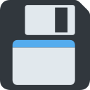

# Wafel Installer Guide

Welcome to the Wafel Installer Guide! This guide will walk you through setting up homebrew, configuring coldboot exploit protection with ISFShax, and managing your Wii U console.

<strong>New to modding?</strong> Start with the <strong><a href="GettingStarted.md">Getting Started</a></strong> section. It covers all the prerequisites, storage preparation, and initial steps to launch the installer on both stock and modded consoles.

---

## Guide Sections

Choose a section below to jump directly to it:

###  [Getting Started](GettingStarted.md)
* Set the correct date and time, check your internet connection, update your console firmware, and launch the Wafel Installer.

###  [Wafel Installer](WafelInstaller.md)
* Walk through the installer prompts, configure partitions (FAT32/WFS), and download/install Aroma, Stroopwafel, and ISFShax.

###  [Backups](SaveBackup.md)
* Locate automated backups of system-unique keys (OTP/SEEPROM) and perform manual backups of your game saves using SaveMii.

###  [Dump & Install Games](DumpInstallGames.md)
* Learn how to dump physical game discs and install games onto your console's storage.

###  [Uninstall](Uninstall.md)
* Learn how to completely remove the homebrew environment, Stroopwafel, and ISFShax to return your console to stock.

